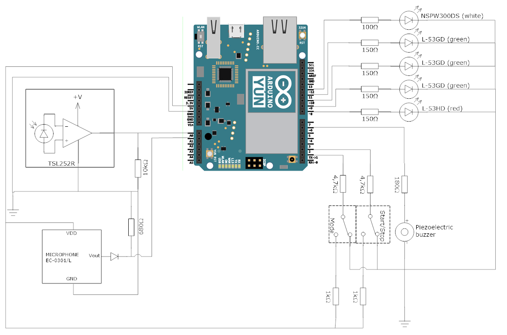

# Multimedia Delay Meter
This project provides code for a multimedia delay measurement device based on Arduino Yún Rev 2. 

The MM-delay meter generates light pulses and audio signals using an LED and a simple speaker. The received signals are captured by a light-to-voltage sensor and a microphone.

## Features

When a generated light or audio signal is captured and recognized at the other end of a multimedia system, the signal delay through the system is measured with ms accuracy.
The device allows two different media types: audio mode or video mode.

The series of measurements are stored in logs in an SD card, where each log contains a measurement series with timestamps and mediatype.
These logs are uploaded to [UNINETT multimedia delay database](http://delay.uninett.no) when the device is connected to WiFi.

The device connects automatically to a known available wireless network. When connected, it automatically uploads any logs that were saved when a WiFi was unavailable. It periodically checks its own WiFi status, and decides whether to reconnect and/or try to upload files based on the current status.

There are two push buttons connected to the MM-delay meter. One button starts or stops a measurement series, and the other button allows the user to switch between the two modes of operation. A press of the mode button while a measurement series is running is equivalent to pressing the stop button, with the addition of changing the mode.

The three green LEDs indicate how many measurements the user has made, and the current mode.
The red LED emits light when the start button is pressed, and is dark when a series has stopped or is complete.
The white LED generates the light pulses that must be captured at the other end of the multimedia system.

## Getting started
#### Requirements
- Arduino Yún Rev 2
- Micro SD card
- Circuit: 

## What's next?
- [ ] Delete old logs when SD card is full
- [ ] Connect to eduroam (WPA2-Enterprise security)
